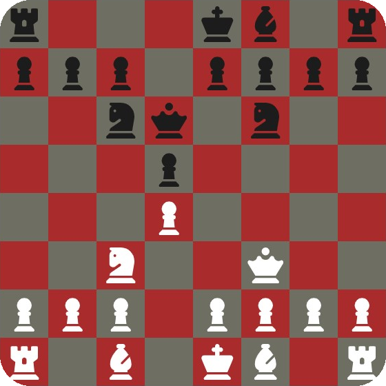

<h1 align=center> ♙ Xadrez simples em Javascript</h1>

 Projeto funcional seguindo um tutorial. Refeito até fazer sem ajuda.

<a href=#sobre-o-projeto>Sobre o projeto </a>
|
<a href=#tutorial-original>Tutorial original</a>

  

  

##  ♔♞ Sobre o projeto  ♕ ♜

Funcionais:
- Movimento de peças: peão, cavalo, bispo, torre, dama e rei.
- Captura de peças: peão, cavalo, bispo, torre, dama e rei.
- Checagem de vencedor: pela não existência de um rei.

Não-funcionais:
- Xeque e xeque-mate.
- En-passant.
- Roque curto.
- Roque longo.

<h1>

   Tutorial original

  </h1>

O tutorial original pode ser acessado através <a href=https://www.youtube.com/watch?v=Qv0fvm5B0EM>deste link</a>

